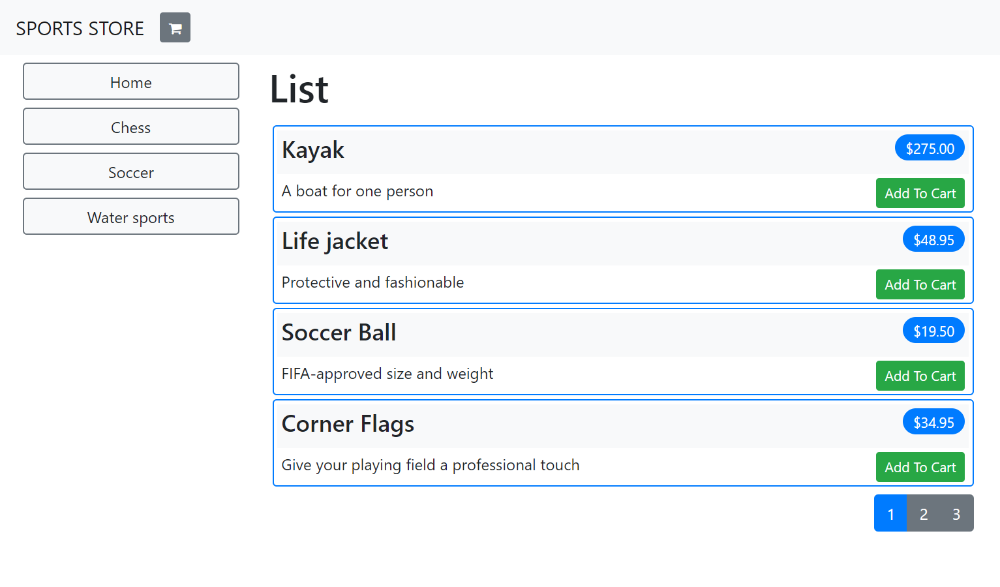

# SportsStore

[![Build Status][build-status-badge]][build-status]
[![Quality Gate Status][quality-gate-status-badge]][quality-gate-status]
[![Coverage][coverage-badge]][coverage]

Based on the "Sports Store: A Real Application" built in the book `"Pro ASP.NET Core MVC 2"` by Adam Freeman.

This project is built on ASP.NET Core 2.2 (the book uses ASP.NET Core 2.0).

## Requirements

- ASP.NET Core 2.2
- Visual Studio 2019

## How to run

File > Open > Project/Solution and hit F5!

## Screen captures

[build-status-badge]: https://dev.azure.com/feliperomeromx/Projects/_apis/build/status/feliperomero3.SportsStore?branchName=master
[build-status]: https://dev.azure.com/feliperomeromx/Projects/_build/latest?definitionId=8&branchName=master
[coverage-badge]: https://img.shields.io/azure-devops/coverage/feliperomeromx/projects/8/master
[coverage]: https://dev.azure.com/feliperomeromx/Projects/_build/latest?definitionId=8&branchName=master
[quality-gate-status-badge]: https://sonarcloud.io/api/project_badges/measure?project=feliperomero3_SportsStore&metric=alert_status
[quality-gate-status]: https://sonarcloud.io/dashboard?id=feliperomero3_SportsStore
